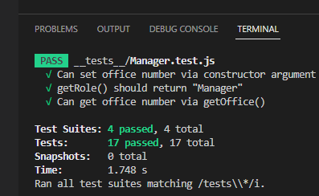

# Object-Oriented Programming: Team Profile Generator
A backend application that will create a team full of managers, engineers, and interns.

## Description
The Team Profile Generator was created to continue to build upon the inquirer package and test creating dynamic html pages based on command line input. 

## Usage
To use this application:
1. Clone to repo
2. Install all the necessary node modules by entering npm i
3. Run node index.js to run the command line prompt
4. Follow the instructions to build your team
5. Once complete select 'build team' and open the team.html file in your browser

## Test
All tests were passed.

## Video Demo
https://youtu.be/My8Ef_HJaBw

